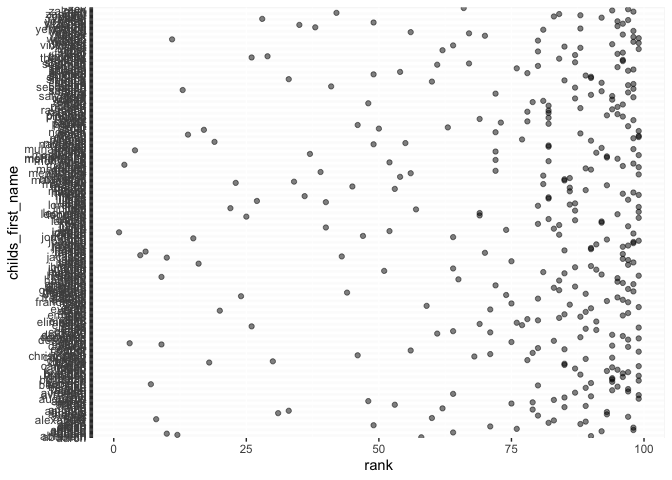

P8105 Homework2
================
Yushan Wang

## Probelm 1

Clean the Mr.trash wheel dataset by omit non-data & note entries, omit
non-dumpster-specific rows, give reasonable names, and round sports
balls to integer

``` r
# import mr.trash dataset and omit note entries
mr_trashwheel_df <- 
  read_excel("data/Trash-Wheel-Collection-Totals-7-2021-sept.xlsx", 
             sheet = "Mr. Trash Wheel",
             range = "A2:N408") %>% 
  
  # omit non-data entries
  select(-Month) %>% 
  
  # omit non-dumpster-specific rows
  drop_na() %>% 
  
  # give reasonable names
  janitor::clean_names() %>% 
  
  # round sports balls
  mutate(sports_balls = round(sports_balls))
```

Import the 2018 & 2019 precipitation dataset

``` r
# import 2018 precipitation dataset and omit note entries and NA entries
precipitation_2018 <-
  read_excel("data/Trash-Wheel-Collection-Totals-7-2021-sept.xlsx", 
             sheet = "2018 Precipitation",
             range = "A2:B14")  

# import 2019 precipitation dataset and omit note entries and NA entries
precipitation_2019 <-
  read_excel("data/Trash-Wheel-Collection-Totals-7-2021-sept.xlsx", 
             sheet = "2019 Precipitation",
             range = "A2:B14")  
```

Combine two dataframe, add a new variable “year”, and convert month
number to character

``` r
# create function to convert month number to character
my.month.name <- Vectorize(function(n) c("january", "february", "narch", 
                                         "april", "may", "june", "july", 
                                         "august", "september", "october",
                                         "november", "december")[n])

precipitation_df <- 
  bind_rows(precipitation_2018, precipitation_2019) %>% 
  mutate("year" = c(rep(2018, 12), rep(2019,12) ),
         Month = my.month.name(Month)) %>% 
  relocate(year) %>% 
  janitor::clean_names()
```

**Descriptions of the above datasets**

There are 344 observations in Mr.trashwheel dataset. Variable “dumpster”
is denoted by numbers range from 1 to 344. Variable “date” is coded as
year-month-day. For example, 2014-05-16. All other variables are coded
as numbers.

There are 18 observations in combined 2018 & 2019 precipitation dataset.
Variable “year” consists of 2018 and 2019. Variable “month” consists of
all twelve month in character The total precipitation, denoted by
variable “total”, range from 0.16 to 10.47

Total precipitation in 2018 was 70.33.

The median number of sports balls in a dumpster in 2017 was 8.

## Probelm 2

Clean the data in pols-month.csv

``` r
pols_month_df <- 
  
  read_csv("data/pols-month.csv") %>% 
  janitor::clean_names() %>% 
  separate(mon, into = c("year", "month", "day"), "-") 
```

    ## Rows: 822 Columns: 9

    ## ── Column specification ────────────────────────────────────────────────────────
    ## Delimiter: ","
    ## dbl  (8): prez_gop, gov_gop, sen_gop, rep_gop, prez_dem, gov_dem, sen_dem, r...
    ## date (1): mon

    ## 
    ## ℹ Use `spec()` to retrieve the full column specification for this data.
    ## ℹ Specify the column types or set `show_col_types = FALSE` to quiet this message.

``` r
#remove day, prez_dem and prez_gop
pols_month_df <- 
  subset(pols_month_df, select = -c(day, prez_dem, prez_gop)) %>% 
  
  # convert month to name use function defined in problem 1
  mutate(
    month = str_remove(month, "^0+"), # remove leading 0
    month = as.numeric(month), 
    month = my.month.name(month)
    ) %>% 
  
  pivot_longer(
    gov_gop:rep_dem,
    names_to = "president",
    #names_prefix = "gov_"
    values_to = "pol_value"
  ) 
```

Clean the data in snp.csv

``` r
snp_df <- 
  read_csv("data/snp.csv") %>% 
  janitor::clean_names() %>% 
  separate(date, into = c("month", "day", "year"), "/") %>% 
  mutate(
    month = as.numeric(month),
    year = as.numeric(year),
    year = ifelse(year > 90, year + 1900, year + 2000),
    month = my.month.name(month),
    ) %>% 
  relocate(year, month, day) %>% 
  rename(snp = close)
```

    ## Rows: 787 Columns: 2

    ## ── Column specification ────────────────────────────────────────────────────────
    ## Delimiter: ","
    ## chr (1): date
    ## dbl (1): close

    ## 
    ## ℹ Use `spec()` to retrieve the full column specification for this data.
    ## ℹ Specify the column types or set `show_col_types = FALSE` to quiet this message.

``` r
#remove day 
snp_df <- subset(snp_df, select = -day)
```

Tidy the unemployment data

``` r
unemployment_df <- 
  read_csv("data/unemployment.csv") %>% 
  janitor::clean_names()
```

    ## Rows: 68 Columns: 13

    ## ── Column specification ────────────────────────────────────────────────────────
    ## Delimiter: ","
    ## dbl (13): Year, Jan, Feb, Mar, Apr, May, Jun, Jul, Aug, Sep, Oct, Nov, Dec

    ## 
    ## ℹ Use `spec()` to retrieve the full column specification for this data.
    ## ℹ Specify the column types or set `show_col_types = FALSE` to quiet this message.

``` r
# renaming month
unemployment_df <- rename(unemployment_df, 
                          january = jan,
                          february = feb,
                          march = mar,
                          april = apr,
                          may = may,
                          june = jun,
                          july = jul,
                          august = aug,
                          september = sep,
                          october = oct,
                          november = nov,
                          december = dec) %>% 
  
  pivot_longer(
    january:december,
    names_to = "month",
    values_to = "unemployment"
  ) 
```

Join the datasets by merging snp into pols, and merging unemployment
into the result.

``` r
pol_snp <- merge(pols_month_df, snp_df , by = c("year", "month")) 

pol_snp_unemployment <- merge(pol_snp, unemployment_df , by = c("year", "month")) 
```

**Description of dataset**

The pols\_month\_df dataset has `r`dim(pols\_month\_df)\[1\]`rows and`r
`dim(pols_month_df)[2]` columns. The years in this dataset range from
1947 to 2015. The variable “president” include character gop and dem,
and the variable pol\_value range from 12 to 301.

The snp\_df dataset has `r`dim(snp\_df)\[1\]`rows and`r `dim(snp_df)[2]`
columns. The years in this dataset range from 1991 to 2090. The variable
“snp” range from 17.049999 to 2107.389893.

The unemployment\_df dataset has
`r`dim(unemployment\_df)\[1\]`rows and`r `dim(unemployment_df)[2]`
columns. The years in this dataset range from 1948 to 2015. The variable
“snp” range from NA to NA.

## Probelm 3

Clean the Popular\_Baby\_Names.csv

``` r
babynames_df <- 
  read_csv("data/Popular_Baby_Names.csv") %>% 
  janitor::clean_names() %>% 
  
  # remove repeated rows
  distinct(ethnicity, childs_first_name, .keep_all = TRUE) %>% 
  
  # convert every word in dataframe lowercase
  mutate(gender = tolower(gender),
         ethnicity = tolower(ethnicity),
         childs_first_name = tolower(childs_first_name)
          )
```

    ## Rows: 19418 Columns: 6

    ## ── Column specification ────────────────────────────────────────────────────────
    ## Delimiter: ","
    ## chr (3): Gender, Ethnicity, Child's First Name
    ## dbl (3): Year of Birth, Count, Rank

    ## 
    ## ℹ Use `spec()` to retrieve the full column specification for this data.
    ## ℹ Specify the column types or set `show_col_types = FALSE` to quiet this message.

Produce table showing the rank in popularity of the name “Olivia” as a
female baby name over time

``` r
olivia_df = filter(babynames_df, childs_first_name == "olivia", gender == "female") 

olivia_df = subset(olivia_df, select = -c(gender, childs_first_name, count))
```

Produce table showing the most popular name among male children over
time.

``` r
popular_df = filter(babynames_df, rank == "1", gender == "male") 

popular_df = subset(popular_df, select = -c(gender, rank, count))
```

Scatter Plot

``` r
male_white_nonhis = filter(babynames_df, year_of_birth == 2016, 
                         ethnicity == "white non hispanic", 
                         gender == "male") 

male_white_nonhis %>% 
  ggplot(aes(x = rank, y = childs_first_name)) + 
  geom_point(alpha = .5)
```

<!-- -->
